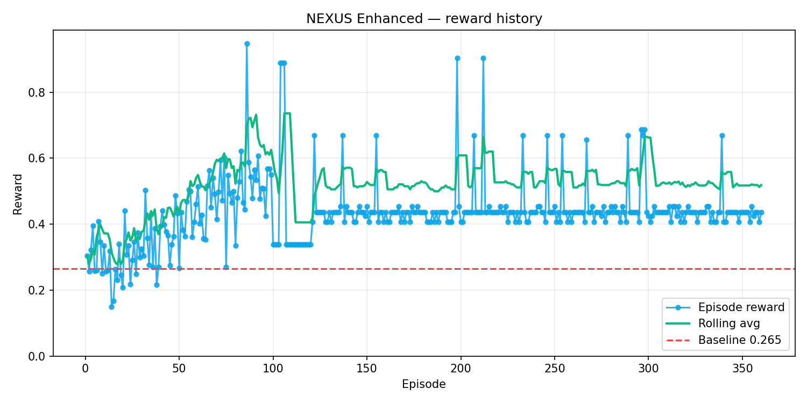

# ⚡ NEXUS Enhanced

**Multi-Agent Enterprise Incident Response RL Environment**  
*Meta PyTorch OpenEnv Hackathon Grand Finale — Team Falcons*

NEXUS Enhanced trains an AI Incident Commander to orchestrate 5 specialist agents across 7 production incident scenarios, culminating in a CrowdStrike-scale global failure affecting 8.5 million machines.

## Judge Fast Path (3-5 min)

Use this section first during judging/review.

- **Live environment (HF Space):** https://kunalkachru23-nexus-enhanced-stage.hf.space/
- **3-minute pitch script:** [`docs/pitch/PITCH.md`](docs/pitch/PITCH.md)
- **2-minute demo walkthrough:** [`docs/pitch/DEMO_WALKTHROUGH.md`](docs/pitch/DEMO_WALKTHROUGH.md)
- **Compliance + judging evidence index:** [`docs/project/JUDGING_EVIDENCE_INDEX.md`](docs/project/JUDGING_EVIDENCE_INDEX.md)
- **Behavioral delta (before vs after):** [`docs/project/BEHAVIORAL_DELTA_PROOF.md`](docs/project/BEHAVIORAL_DELTA_PROOF.md)
- **Compliance lock matrix:** [`docs/project/COMPLIANCE_LOCK_MATRIX.md`](docs/project/COMPLIANCE_LOCK_MATRIX.md)
- **HF blog draft (publish-ready):** [`docs/blog/blog_post_hf.md`](docs/blog/blog_post_hf.md)
- **YouTube (<2 min):** pending final recording (intentionally last-mile)

### Canonical evidence snapshot (frozen)

From [`docs/project/snapshots/submission_snapshot_20260424T164826Z.md`](docs/project/snapshots/submission_snapshot_20260424T164826Z.md):

- Episodes: `387`
- Average reward: `0.4634`
- Best reward: `1.0032`
- Baseline reward: `0.265`
- Improvement: `+74.9%`

### Baseline vs trained (quick read)

| Signal | Baseline (pre-event benchmark) | Trained (latest frozen snapshot) |
|---|---:|---:|
| Average reward | 0.2650 | 0.4634 |
| Best reward | - | 1.0032 |
| Improvement | - | +74.9% |
| Behavioral evidence | Scripted/weak coordination baseline pattern | See [`docs/project/BEHAVIORAL_DELTA_PROOF.md`](docs/project/BEHAVIORAL_DELTA_PROOF.md) |

## Quick Start

```bash
pip install -r requirements.txt

# Run all tests (~220+)
pytest tests/ -q

# Start the server
uvicorn server.app:app --reload --port 7860

# Open the incident command dashboard
open http://localhost:7860/web

# Auto-demo (no server needed)
python -c "from server.app import run_demo; import json; print(json.dumps(run_demo('INC003'), indent=2))"
```

## Architecture

6 agents | 5 enterprise tools | 7 incident cases | OpenEnv v0.2.3

```
Incident Commander (IC)    ← trained via GRPO on Qwen2.5-1.5B
├── L1 Support             → SimSlack + SimCustomerPortal
├── L2 Engineer            → SimDatadog (rate-limited)
├── SRE Agent              → SimRunbook (schema drift v1→v2 in INC007)
├── Product Manager        → SimJira (VP approval + change freeze)
└── Oversight Agent        → monitor() + analyse() + explain()
```

Each agent has **partial observability** — only sees its role-scoped tool outputs. The IC synthesizes partial views into a coordinated incident response.

## Reward Model

```
episode_reward = (
    0.30 × mttr_score       # faster resolution
  + 0.25 × diagnosis_score  # root cause + evidence (anti-shortcut)
  + 0.20 × customer_score   # proactive notification required
  + 0.15 × coordination     # no duplicate tool queries
  + 0.05 × oversight        # protocol compliance
  + depth_bonus             # UNCAPPED reasoning quality (Mercor)
)
```

Expert criteria rotate every 4 episodes (speed/communication/technical/cost) — Snorkel AI sub-theme.

## Incident Library

| ID | Difficulty | Key Challenge |
|----|------------|---------------|
| INC001 | Easy | Payment service timeout |
| INC002 | Easy | DB pool exhaustion, cascade |
| **INC003** | **Medium** | **Red herrings + ML memory leak** ← primary demo |
| INC004 | Hard | Vendor retry storm, masked root cause |
| INC005 | Hard | JWT key mismatch, conflicting signals |
| INC006 | Very Hard | Multi-region CDN misrouting |
| INC007 | Nightmare | CrowdStrike-scale + live schema drift |

## Training

```bash
# GRPO fine-tuning (run in Colab with GPU)
# Open notebooks/grpo_colab_v2.ipynb

# Pre-event baseline (30 episodes, avg reward 0.265)
python training/train.py --episodes 30 --difficulties easy,medium
```

## Training data visualization

Episode rewards from the deployed Space (`GET /learning-curve`) — same data as the dashboard training tab.

```bash
python scripts/export_reward_plot.py \
  --url https://kunalkachru23-nexus-enhanced-stage.hf.space \
  --out docs/images/training_reward_curve.png
```



Caption: blue line is per-episode reward, green is rolling average, red dashed line is baseline (`0.265`).

## OpenEnv (reproduce)

Per **hackathon compliance criteria**, the submission uses **OpenEnv (latest release)** in the toolchain—not only a custom HTTP server. Reproduce validation with the commands below.

**Local (dev machine, after `pip install "openenv>=0.2.3"`):**

```bash
cd nexus-enhanced
openenv validate .
pytest tests/ -q
uvicorn server.app:app --host 127.0.0.1 --port 7860
# second terminal:
openenv validate --url http://127.0.0.1:7860
```

**HF Space (after `openenv push`):** use your Space URL, e.g. `https://kunalkachru23-nexus-enhanced-stage.hf.space`:

```bash
openenv validate --url https://kunalkachru23-nexus-enhanced-stage.hf.space
./gate.sh --skip-regression --skip-local-api --hf-url https://kunalkachru23-nexus-enhanced-stage.hf.space
```

**Deploying with OpenEnv:** use `openenv push . --repo-id <user>/<space> --exclude .hfignore` (or **`./gate.sh --push`**, which adds `--exclude` for you). OpenEnv does not load `.hfignore` unless you pass it via `--exclude`; omitting it does **not** break the build, it only uploads extra paths (less lean). See `docs/guides/QUICK_START.md` for a short rationale.

`requirements.txt` **omits** `openenv` on the Space Docker image to keep builds reliable; the **Colab notebook** installs `openenv>=0.2.3` to satisfy the **Colab + OpenEnv** portion of compliance. Contract-only routes (`/metadata`, `/schema`, `GET /state`, `POST /mcp`) satisfy `openenv validate --url`; episode logic uses **`/reset`**, **`/step/{session_id}`**, **`/state/{session_id}`** only.

## API Endpoints

| Method | Path | Description |
|--------|------|-------------|
| POST | `/reset` | Start new episode |
| POST | `/step/{session_id}` | Execute IC action |
| GET | `/state/{session_id}` | Full episode state |
| GET | `/reward/{session_id}` | Live reward breakdown |
| POST | `/demo/run/{incident_id}` | Auto-demo mode |
| GET | `/web` | Incident command dashboard |
| GET | `/health` | Health (`status: healthy` for OpenEnv CLI) |
| GET | `/metadata` | OpenEnv discovery stub |
| GET | `/schema` | OpenEnv schema stub |
| GET | `/state` | OpenAPI stub (use `/state/{session_id}` for data) |
| POST | `/mcp` | OpenEnv JSON-RPC stub |
| GET | `/metrics` | Training metrics |

## Sub-Theme Coverage

- **Scaler AI Labs** — 5 enterprise tools with business rule nuances
- **Fleet AI** — OversightAgent: monitor + analyse + explain
- **Halluminate** — 6 agents + coalition debate + partial observability
- **Scale AI** — IT incident management domain
- **Mercor** — Uncapped reasoning depth bonus
- **Snorkel AI** — Rotating expert review board (4 criteria)
- **Patronus AI** — Live schema drift in INC007 at step 18

## Pitch, plan, and compliance evidence

Documentation lives under [`docs/`](docs/) (guides, deployment, project status, pitch/demo scripts, blog drafts).

- **[`docs/pitch/PITCH.md`](docs/pitch/PITCH.md)** — 3-minute spoken script + 2-minute Q&A bullets (organizer pitch format).
- **[`docs/project/PLAN_OF_ACTION.md`](docs/project/PLAN_OF_ACTION.md)** — hackathon compliance matrix + prioritized todo table.
- **`scripts/export_reward_plot.py`** — export reward curve PNG from `--url` or `episode_rewards.json` (slides / observable improvement evidence). Canonical chart (tracked in git): **`docs/images/training_reward_curve.png`** (see section above).

## Final submission checklist (compliance-ready)

- [ ] Space URL is live and included in final form: `https://kunalkachru23-nexus-enhanced-stage.hf.space/`
- [ ] `openenv validate .` passes locally.
- [ ] `openenv validate --url https://kunalkachru23-nexus-enhanced-stage.hf.space` passes.
- [ ] Full gate green: `./gate.sh --push`
- [ ] Latest frozen snapshot files are refreshed and referenced:
  - `docs/project/snapshots/submission_snapshot_20260424T164826Z.md`
  - `docs/project/snapshots/component_metrics_20260424T164826Z.md`
- [ ] Blog/video/slide links are present and clickable from this README:
  - Blog draft: [`docs/blog/blog_post_hf.md`](docs/blog/blog_post_hf.md)
  - Video link: _pending final recording_
- [ ] Pitch numbers match frozen snapshot values (no stale metrics in scripts).

## Blog Post

See [`docs/blog/blog_post_hf.md`](docs/blog/blog_post_hf.md) for the publish-ready HuggingFace blog draft (includes reward model deep-dive, training methodology, and demo walkthrough). Publish and add the public URL to your submission package (blog or short video, per organizer requirements).

## Team

Team Falcons — [kunalkachru23@gmail.com](mailto:kunalkachru23@gmail.com)
